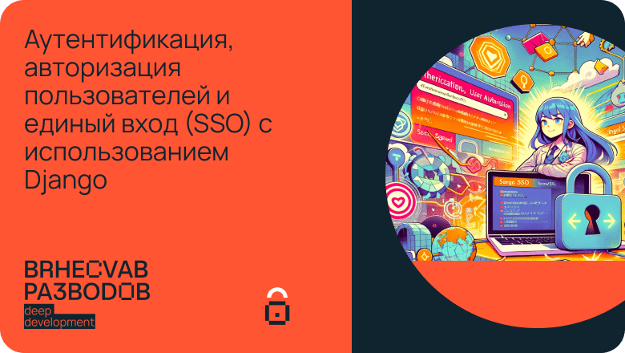

# Аутентификация, авторизация пользователей и единый вход (SSO) с использованием Django

Этот репозиторий содержит примеры кода для статьи.

## Содержание

* [Установка](#установка)
* [Настройка](#настройка)
* [Лицензия](#лицензия)
* [Контакты](#контакты)


## Установка
Для запуска примеров вам понадобится установить:

* [Python 3.x](#установка-python-3x)
* [Установка зависимостей проекта](#установка-зависимостей-проекта)
* [Запуск Keycloak](#запуск-keycloak)


### Установка Python 3.x
Скачайте и установите Python 3.x с официального сайта https://www.python.org/downloads/


### Установка зависимостей проекта

Выполните следующую команду в командной строке:

Для Mac/Linux
````bash
pip install -r requirements.txt
````

Для Windows
````bash
python3 -m  pip install -r requirements.txt
````

### Запуск keycloak

Для запуска Keycloak, следуйте следующим шагам:

1. **Установите Docker и Docker Compose**
   Если у вас еще не установлены Docker и Docker Compose, их нужно сначала установить. Docker позволяет запускать контейнеры, а Docker Compose используется для управления многоконтейнерными Docker приложениями.

2. **Откройте Терминал или Командную Строку**
   Откройте терминал на Linux или Mac, или командную строку (CMD) на Windows.

3. **Перейдите в Папку с `docker-compose.yml`**
   Используйте команду `cd` для перехода в папку, где находится ваш файл `docker-compose.yml`. Например:
   ```bash
   cd путь/до/вашей/папки/keycloak
   ```

4. **Запустите Docker Compose**
   Выполните следующую команду, чтобы запустить ваш проект:
   ```bash
   docker-compose up
   ```
   Эта команда считывает файл `docker-compose.yml`, скачивает необходимые Docker образы и запускает контейнеры.

5. **Проверьте Запущенные Контейнеры**
   Чтобы убедиться, что все контейнеры запущены, вы можете использовать команду:
   ```bash
   docker-compose ps
   ```

6. **Доступ к Keycloak**
   После того, как контейнеры будут запущены, Keycloak должен быть доступен по адресу, указанному в файле `docker-compose.yml`, обычно это `http://localhost:8080` или аналогичный.

7. **Остановка и Удаление Контейнеров**
   Чтобы остановить и удалить контейнеры, используйте команду:
   ```bash
   docker-compose down
   ```

8. **Дополнительные Настройки**
   В файле `docker-compose.yml` используется не официальная сборка `sleighzy/keycloak:16.1.0-arm64` для процессоров на ARM архитектуре. Если нужно запустить на Apple Chip может пользоваться ей, в противном случае замените на `jboss/keycloak`.

Убедитесь, что ваш `docker-compose.yml` правильно настроен и содержит все необходимые инструкции для запуска Keycloak.


## Настройка

1. Скачайте репозиторий
2. В файле django_sso/settings.py в переменной DATABASES - укажите ваши данные для доступа к БД
3. Применить миграции к БД (перед первым запуском)
```
$ python manage.py migrate
```

4. Создать супер пользователя:

```
$ python manage.py createsuperuser
```

5. Запускаем проект
```
$ python manage.py runserver
```

## Лицензия

Этот код распространяется под лицензией MIT. См. LICENSE для получения подробной информации.

## Контакты

Если вам понравилась статья, или просто хотите больше узнать о программировании подписыватейсь на мой telegram канал [Код со смыслом](https://t.me/deep_development)
